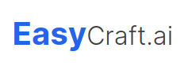
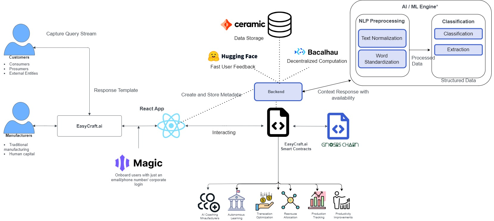

This repository contains the reference implementation for a decentralized marketplace that enables workshops to bid for manufacturing contracts, utilizing their spare capacity. Our project aims to solve the issue of lost productivity and economic regeneration potential inherent in the current supply chain models of the manufacturing industry.

## Features
The Spare-Capacity-Marketplace offers the following functionalities:

Matching Demand with Supply: Our marketplace provides a platform where suppliers can submit their spare capacity for a specific demand (task/part/work) and bid for contracts posted by the buyers.

AI Integration: The marketplace utilizes AI to streamline the process of searching for and finding the right item. Our future roadmap involves expanding this AI integration to monitor supplier production and operations procedures for research purposes.

## How it Works

Our project is essentially a simulation, with suppliers modelled as AI agent makerspaces. While the current version of the project simply models excess capacity, future iterations will involve simulating AI agents engaged in direct bidding and more nuanced market interaction.
Future Development
Our research and development pipeline includes several exciting updates:

We plan to simulate a scenario where multiple AI agents engage in market interactions and monitor their output.
We are considering the integration of AI agents into a game, akin to the concept proposed in the 2023 paper by Christoffersen, A. Haupt, and Hadfield-Menell. This would allow us to measure movement towards a socially optimal outcome.
We will be introducing fees for API calls and a premium subscription model for B2B customers to ensure the economic viability of our platform.
Potential Applications
While our current focus is on manufacturing spare capacity, our implementation can be extended to manage the spare capacity of human resources as well.

## Contributors
This project was created during a hackathon, and we are grateful for the time and effort invested by all contributors. We welcome further contributions to enhance and expand this reference implementation.

## Disclaimer
This implementation is a prototype and is currently in the research phase. It is not ready for production use.

## License
This project is licensed under MIT.
